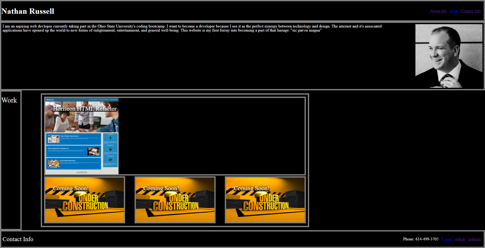

# Nathan Russell Web Portfolio

This website is designed to be a working portfolio and representation of my work as I go through the Ohio State University's coding bootcamp. This website currently shows my knowledge of the box model and general css styling. No javascript or other scripting methods were used. 

## Screenshot

## Installation

git pull from git@github.com:nathanrusselldev/russellportweb.git

## Links

https://nathanrusselldev.github.io/russellportweb/#contact

## Usage

Use to test functionality, critique code, and for general purposes. 

## License

Any images used herein have been licensed under a creative commons license.

Copyright (c) [2022] [NathanRussell]

Permission is hereby granted, free of charge, to any person obtaining a copy
of this software and associated documentation files (the "Software"), to deal
in the Software without restriction, including without limitation the rights
to use, copy, modify, merge, publish, distribute, sublicense, and/or sell
copies of the Software, and to permit persons to whom the Software is
furnished to do so, subject to the following conditions:

The above copyright notice and this permission notice shall be included in all
copies or substantial portions of the Software.

THE SOFTWARE IS PROVIDED "AS IS", WITHOUT WARRANTY OF ANY KIND, EXPRESS OR
IMPLIED, INCLUDING BUT NOT LIMITED TO THE WARRANTIES OF MERCHANTABILITY,
FITNESS FOR A PARTICULAR PURPOSE AND NONINFRINGEMENT. IN NO EVENT SHALL THE
AUTHORS OR COPYRIGHT HOLDERS BE LIABLE FOR ANY CLAIM, DAMAGES OR OTHER
LIABILITY, WHETHER IN AN ACTION OF CONTRACT, TORT OR OTHERWISE, ARISING FROM,
OUT OF OR IN CONNECTION WITH THE SOFTWARE OR THE USE OR OTHER DEALINGS IN THE
SOFTWARE.

